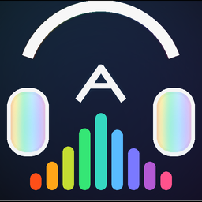

<p align="center">
  
</p>

<h1 align="center">ArDali WebMedia</h1>

<p align="center">
  Tauri + Rust tabanlı Linux medya oynatıcı, web platform yöneticisi, eklenti mağazası ve gelişmiş ses motoru.
</p>

<p align="center">
  <a href="https://github.com/Muhammed-Dali/ArDali/releases/latest">
    
  </a>
  <a href="https://github.com/Muhammed-Dali/ArDali/blob/main/LICENSE">
    
  </a>
  
  
  
</p>

## ArDali Nedir?

ArDali WebMedia 4.0.0, eski Electron tabanlı ArDali fikrinin daha hafif ve daha yerel çalışan Tauri/Rust sürümüdür. Uygulama; yerel müzik ve video oynatma, web tabanlı müzik platformları, gelişmiş ses efektleri, projectM görselleştirici, MPRIS entegrasyonu ve resmi eklenti mağazasını tek masaüstü arayüzünde birleştirir.

Bu sürümün ana hedefi daha düşük kaynak kullanımı, daha güçlü Linux masaüstü entegrasyonu ve web medyasına uygulanabilen gerçek zamanlı ses işleme altyapısıdır.

## Öne Çıkanlar

| Alan | Özellik |
| --- | --- |
| Yerel medya | Müzik, video ve galeri bölümleri; kitaplık kaydı, kapak görseli çıkarma, oynatma konumu hatırlama |
| Web platformları | YouTube, YouTube Music, Spotify, Deezer, Facebook, Instagram, TikTok, Telegram ve X için yerleşik web alanı |
| ArDali Mağaza | Resmi kullanıcı betiği eklentileri; kur/aç-kapat akışı; izin tabanlı DOM, stil ve depolama modeli |
| Web ses motoru | `dali-lang` ile derlenen 32 bant Web Audio EQ motoru ve web medya elementlerine gerçek zamanlı efekt uygulama |
| Native ses | Rust + BASS/BASS FX tabanlı yerel oynatma, DSP zinciri, spectrum verisi ve cihaz durumu |
| Ses efektleri | 32 bant EQ, parametrik EQ, reverb, compressor, limiter, true peak, auto gain, bass boost, exciter, de-esser, noise gate, echo, crossfeed, stereo widener, surround, tape saturation ve bit-depth/dither |
| Görselleştirici | projectM/Milkdrop presetleri, canlı spectrum, ritme duyarlı görsel modlar |
| Linux entegrasyonu | Tray menüsü, MPRIS medya kontrolleri, DBus köprüsü ve yerel medya sunucusu |

## Eklenti Mağazası

ArDali Mağaza, uygulamanın web bölümünde çalışan resmi eklentileri yönetir. Eklentiler katalogdan okunur, kullanıcı tarafından kurulur ve hedef URL ile eşleştiğinde web görünümüne uygulanır.

Mevcut mağaza altyapısı:

- Katalog: `public/ardali-store/catalog.json`
- Eklenti formatı: resmi `userscript`
- İzin modeli: `dom`, `style`, `storage`
- Kurulum durumu: tarayıcı yerel depolamasında saklanır
- Örnek resmi eklenti: YouTube Focus Mode

Eklenti sistemi Tauri tarafına doğrudan erişim vermez; eklenti ortamında `__TAURI__`, `process`, `require` ve `invoke` kapatılır. Böylece web sayfası üzerinde odaklı iyileştirmeler yapılırken uygulama çekirdeği korunur.

## Web Ses Motoru

ArDali'nin web ses katmanı `dali-lang` ile tanımlanan bir EQ programını Web Audio API grafiğine derler. Derleme akışı:

```bash
npm run dali:web:build
```

Bu komut `dali-lang/examples/web-eq32-reference.dl` dosyasını okuyup şu çıktıları üretir:

- `src/web/generated/dali-web-eq32.generated.js`
- `src/web/generated/daliWebEq32.ts`

Web motoru, desteklenen web sayfalarındaki medya elementlerini yakalar ve şu efektleri uygulayabilir:

- 32 bant EQ
- Preamp ve limiter
- Bass, mid, treble ton kontrolleri
- Parametrik EQ katmanları
- Compressor, true peak limiter ve auto gain
- Exciter, de-esser, noise gate, echo, reverb ve stereo genişletme

## Yerel Ses Motoru

Yerel müzik oynatma tarafında Rust çekirdeği BASS ve BASS FX ile çalışır. Bu motor dosya yükleme, oynatma, duraklatma, seek, volume, spectrum analizi ve DSP parametrelerini Tauri komutları üzerinden arayüze bağlar.

Öne çıkan yerel ses özellikleri:

- 32 bant EQ ve gelişmiş DSP zinciri
- Spectrum ve raw/processed analiz verisi
- projectM için PCM besleme
- Çıkış cihazı durumu ve kulaklık algılama
- MPRIS ile masaüstü medya tuşları desteği

## Web Platform Yöneticisi

Web görünümü Tauri penceresinden ayrı yönetilir ve uygulama içindeki web alanına yerleştirilir. Kullanıcı platformlar arasında geçiş yapabilir, geri/ileri gezinebilir, web verilerini temizleyebilir ve gizlilik ayarlarını düzenleyebilir.

Web ayarları arasında şunlar bulunur:

- Kalıcı oturum veya gizli mod
- Son platformu hatırlama ve oturum geri yükleme
- Kamera, mikrofon, konum, bildirim ve popup izinleri
- HTTPS tercihleri, referrer azaltma ve takip parametresi temizleme
- Cache, cookie, site verisi ve geçmiş temizleme seçenekleri
- Desktop/mobile/default user agent seçimi

## projectM Görselleştirici

ArDali, ayrı bir native projectM görselleştirici sürecini başlatabilir ve müzikten alınan PCM/spectrum verisiyle besleyebilir. `public/visualizer-presets` içindeki Milkdrop presetleriyle ritme duyarlı görseller üretir.

Derleme:

```bash
npm run visualizer:build
```

## Geliştirme

Gerekenler:

- Node.js ve npm
- Rust toolchain
- Tauri 2 için Linux sistem bağımlılıkları
- CMake ve C++ derleyici

Kurulum ve geliştirme:

```bash
git clone https://github.com/Muhammed-Dali/ArDali.git
cd ArDali
npm install
npm run tauri:dev
```

Frontend derleme:

```bash
npm run build
```

Tauri paketleme:

```bash
npm run tauri:build
```

Rust kontrolü:

```bash
npm run check:rust
```

Katkı vermek isteyen geliştiriciler için branch, test ve pull request akışı `CONTRIBUTING.md` dosyasında açıklanır.

## Komutlar

| Komut | Açıklama |
| --- | --- |
| `npm run tauri:dev` | Dali web motorunu derler ve Tauri geliştirme modunu açar |
| `npm run build` | Frontend üretim derlemesini yapar |
| `npm run tauri:build` | Masaüstü uygulama paketlerini üretir |
| `npm run visualizer:build` | Native projectM görselleştiriciyi derler |
| `npm run dli:build` | DLI analizörlerini derler |
| `npm run eq-presets:build` | EQ preset indeksini üretir |
| `npm run clean` | Üretilen build çıktılarını temizler |

## Proje Yapısı

```text
src/                         React arayüzü
src/web/                     Web platform, ayar ve eklenti yöneticileri
src-tauri/                   Rust/Tauri çekirdeği
src-tauri/src/native_audio.rs Yerel ses motoru
src-tauri/src/webview_manager.rs GTK/WebKit web görünümü yönetimi
dali-lang/                   Dali dili ve Web Audio derleyicisi
public/ardali-store/         Resmi eklenti mağazası
public/eq-presets/           EQ preset kataloğu
public/visualizer-presets/   Milkdrop/projectM presetleri
visualizer/                  Native projectM görselleştirici
scripts/                     Derleme ve bakım betikleri
```

## Durum

ArDali WebMedia aktif geliştirme aşamasındadır. Tauri/Rust sürümü yeni mimariye geçtiği için bazı eski Electron özellikleri yeniden yazılmakta veya daha yerel çalışan karşılıklarıyla değiştirilmektedir.

## Lisans

Bu proje MIT lisansı ile yayınlanır. Ayrıntılar için `LICENSE` dosyasına bakın.
